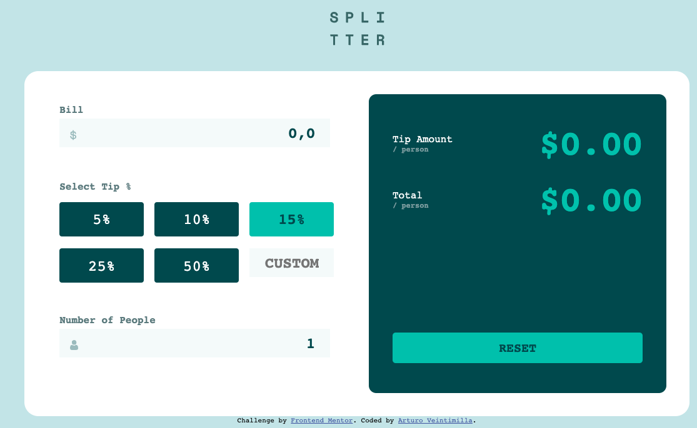
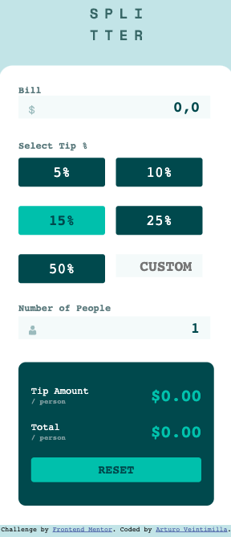

# Frontend Mentor - Tip calculator app solution

This is a solution to the [Tip calculator app challenge on Frontend Mentor](https://www.frontendmentor.io/challenges/tip-calculator-app-ugJNGbJUX). Frontend Mentor challenges help you improve your coding skills by building realistic projects.

## Table of contents

- [Overview](#overview)
  - [The challenge](#the-challenge)
  - [Screenshot](#screenshot)
  - [Links](#links)
- [My process](#my-process)
  - [Built with](#built-with)
  - [What I learned](#what-i-learned)
- [Author](#author)

## Overview

### The challenge

Users should be able to:

- View the optimal layout for the app depending on their device's screen size
- See hover states for all interactive elements on the page
- Calculate the correct tip and total cost of the bill per person

### Screenshot

### Links

- Solution URL: (https://github.com/aavv8931/tip-calculator)
- Live Site URL: [Add live site URL here](https://tip-calculator-kfu57ypeg-aavv8931.vercel.app/com)

## My process

Basically, this is my first time doing a project with JS and to be honest it was difficult, but not impossible. 
I have to give credit to many people especialy to guy from Youtube!

### Built with

- Semantic HTML5 markup
- Flexbox
- CSS Grid
- Mobile-first workflow
- Vanilla JS

### What I learned

I have seen JS exercises before, but this was the first that I tried to implement completely with functions, addEventListeners. Now I have more notion of how JS works as a whole

## Author

- Frontend Mentor - [@aavv8931](https://www.frontendmentor.io/profile/@aavv8931)
- Twitter - [@aavv89](https://www.twitter.com/aavv89)
